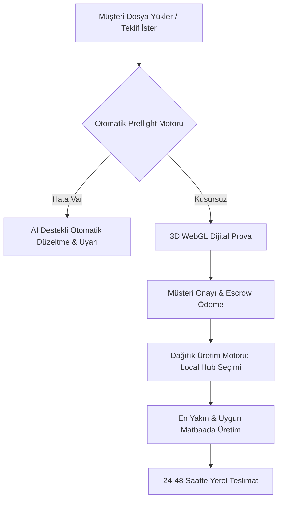

# BaskıYeri: Global Pazar Stratejisi, Rakip Analizi ve Uygulama Yol Haritası

## 📌 1. Yönetici Özeti (Pazar Gerçeği)

Baskı, tabela, ambalaj ve promosyon sektörü dünyada **"fiziksel üretimden dijital üretim orkestrasyonuna"** doğru evrilmektedir. 
Global ölçekte bir baskı platformunun başarısı, sadece ürün sergileyip sipariş alan klasik bir e-ticaret sitesi olmaktan değil; **üretim mühendisliği, otomatik dosya doğrulama (prepress), dağıtık üretim yönlendirmesi ve güvenli ödeme/onay mekanizması** sunmasından geçer.

Baskı pazarındaki ihtilafların ve iadelerin %90'ı fiyattan değil; **"müşterinin ekranda gördüğü dijital tasarım ile matbaadan çıkan fiziksel baskı arasındaki uyumsuzluktan"** kaynaklanır. Bu uyumsuzluğu yazılımla çözen platformlar global pazar lideri haline gelmektedir.

---

## 🔍 2. Kullanıcı ve Üretici Ağrı Noktaları (Pazar Araştırması)

### 👤 Müşteri (B2B & B2C) Tarafındaki Sorunlar:
1. **Yüksek Minimum Sipariş Adetleri (MOQ):** Küçük işletmeler 50 adet özel kutu veya 100 broşür isterken, geleneksel matbaaların kalıp/ayar maliyeti nedeniyle yüksek adetler dayatması.
2. **"Tasarımım Ekranda Başka, Baskıda Başka Çıktı":** RGB/CMYK renk uzayı farkı, taşma payı (bleed) eksikliği veya düşük çözünürlük (72 DPI) nedeniyle kesilen yazılar ve soluk renkler.
3. **Teklif Sürecinin Ağır İşlemesi:** Fiyat almak için günlerce süren e-posta ve telefon trafiği, şeffaf olmayan fiyatlandırma.
4. **Kalite ve İade Güvencesi Eksikliği:** Kusurlu baskı geldiğinde sorumluluğun doğrudan müşteriye atılması ve para iadesi garantisinin olmaması.

### 🏭 Üretici (Matbaa & Atölye) Tarafındaki Sorunlar:
1. **"Baskıya Hazır Olmayan Dosya" Kâbusu (Prepress Yükü):** Canva, Word veya düşük çözünürlüklü JPG olarak gelen dosyaları baskıya hazırlamak için personelin saatlerce ücretsiz mesai harcaması.
2. **Atıl Makine Kapasitesi:** Ofset veya dijital baskı makinelerinin belirli gün veya saatlerde boş yatması; atıl kapasitenin nakde dönüştürülememesi.
3. **Tahsilat ve Cayma Riski:** Özel üretim yapıldıktan sonra müşterinin siparişten cayması veya ödemeyi geciktirmesi.
4. **Standart Olmayan Müşteri Talepleri:** Kağıt cinsi, gramaj, selefon, lak gibi teknik detayları müşteriden öğrenmek için harcanan zaman kaybı.

---

## ⚖️ 3. Mevcut Projede (BaskıYeri) Ne Kalmalı, Ne Gelişmeli?

| Bileşen | Durum | Gerekçe ve Yol Haritası |
| :--- | :---: | :--- |
| **Hibrit Model (E-Ticaret + RFQ)** | **KORUNMALI** | Standart ürünler (kupa, kartvizit) sepete atılırken; tabela, özel ambalaj ve fuar standı mutlaka teklif (RFQ) gerektirir. Bu çift kanatlı yapı sektörün doğasına tam uyar. |
| **Sipariş Durum Akışı (`OrderWorkflowService`)** | **KORUNMALI** | `pending` $\rightarrow$ `design_review` $\rightarrow$ `in_production` $\rightarrow$ `ready_to_ship`... sıralaması, baskı sektöründe yaşanacak hukuki ve operasyonel anlaşmazlıkları önleyen katı bir durum makinesidir. |
| **Tasarım Onay Modülü (`DesignApproval`)** | **KORUNMALI & GELİŞTİRİLMELİ** | Onay verilmeden üretime geçilmemesi kuralı harika. Mevcut statik görsel onayına ek olarak 3D/interaktif önizleme entegre edilmelidir. |
| **Mesaj Moderasyonu (`ModerationService`)** | **KORUNMALI** | Platform dışına kaçışı (telefon, e-posta, WhatsApp, sosyal medya) engelleyerek pazar yeri komisyonunu korur. |
| **Serbest Metinli Teklif Formu** | **DEĞİŞTİRİLMELİ** | Müşterinin serbest metin yazdığı RFQ matbaacıyı yorar. Standart parametrik formlara geçilmelidir (Gramaj, Ebat, Kağıt Türü, Laminasyon). |
| **Freelancer İlan Modülü** | **DEĞİŞTİRİLMELİ** | Bağımsız bir iş panosu yerine, doğrudan teklif ve sipariş sürecine **"Tasarımım Yok (+Tasarımcı Desteği Ekle)"** şeklinde entegre edilmelidir. |
| **Dosya Yükleme Süreci** | **ACİL GELİŞTİRİLMELİ** | Arka planda otomatik **Preflight (Dosya Sağlık Denetimi)** yapılmalı; CMYK, bleed ve DPI kontrolleri yükleme anında doğrulanmalıdır. |
| **Coğrafi Kapsam** | **GENİŞLETİLMELİ** | Türkiye odaklı `TurkiyeIl` yapısından; ülke, bölge ve lojistik hub tabanlı dağıtık üretim yapısına geçilmelidir. |

---

## 🛡️ 4. Globalde Benzersiz ve Taklit Edilemez Rekabet Avantajı (Moat)

Teoride değil, yazılımla sahada uygulanabilir 4 kritik yapı taşı:

### 1. Otomatik Preflight & AI Dosya Onarım Motoru (Teknik Kale)
* **Problem:** Matbaalar zamanlarının %30'unu hatalı dosyaları düzeltmekle kaybeder.
* **Çözüm:** Dosya yüklendiğinde arka planda çalışan mikroservis:
  - Renk uzayını denetler (RGB ise tek tıkla ISO Coated v2 CMYK'ya çevirir).
  - Taşma payını (3mm bleed) denetler; yoksa kenar piksellerinden otomatik tamamlar.
  - Efektif çözünürlüğü hesaplar (150 DPI altıysa kullanıcıyı uyarır).
  - Güvenli alana taşan metinleri kırmızı çerçeveyle gösterir.
* **Sonuç:** Matbaa sistemi açtığında %100 baskıya hazır dosya bulur. İade ve hata riski sıfırlanır.

### 2. Dağıtık Yerel Üretim Yönlendirmesi (Distributed Local Production Routing)
* **Problem:** Sınır ötesi ağır baskı/tabela kargolaması yüksek maliyet, gümrük takılması ve karbon salınımı yaratır.
* **Çözüm:** Siparişi tek bir merkezden üretmek yerine; yazılım siparişi alır, dosyayı hazırlar ve müşteriye en yakın onaylı yerel üreticiye (**Local Hub**) iletir.
* **Fayda:** 24-48 saatte yerel teslimat, sıfır gümrük vergisi, düşük kargo maliyeti (Gelato ve Cloudprinter modeli).

### 3. 3D WebGL / Canvas Dijital Prova (Soft Proofing)
* Müşterinin ekranda gördüğü kutunun katlama yerleri, kartvizitin lak/varak yansımaları veya tabelanın duvardaki simülasyonu 3 boyutlu olarak tarayıcıda döndürülebilir olmalıdır (Packhelp'in başarısının sırrı).

### 4. Güvenli Havuz (Escrow) ve Parametrik Standartlaştırma
* B2B siparişlerde tutarlar yüksektir. Müşteri parayı platform havuzuna yatırır; üretici dijital provayı yükleyip müşteri onaylayınca üretime başlar; kargo teslim edildiğinde üreticiye hakediş aktarılır. İki taraf için de mutlak güvenlik sağlanır.

---

## 🌍 5. Global Benzer Platformlar ve Karşılaştırma Matrisi

| Platform | İş Modeli | Güçlü Yönleri | Eksik / Zayıf Yönleri | BaskıYeri'ne Göre Konumu |
| :--- | :--- | :--- | :--- | :--- |
| **Gelato** | Global POD Ağı (140+ Hub, 32+ Ülke) | Shopify/Etsy entegrasyonu, sıfır stok, yerel üretim, API-first mimari. | Özel sipariş, karmaşık RFQ, tabela ve ambalaj işleri yok. Sadece standart katalog ürünleri (tişört, poster vb.). | Gelato bir dropshipping altyapısıdır; BaskıYeri ise özel sipariş/RFQ kabiliyetine sahip bir pazaryeridir. |
| **Helloprint** | B2B & Kurumsal Baskı Pazaryeri | Çok şubeli şirketler için kurumsal portal, geniş Avrupa matbaa ağı. | Kullanıcı arayüzü geleneksel, özel üretim ambalajlarda 3D konfigüratör zayıf. | **BaskıYeri için en yakın modeldir.** BaskıYeri'nin tasarım onay ve freelancer entegrasyonu bunu ileri taşır. |
| **Packhelp** | B2B Özel Ambalaj Pazaryeri | Tarayıcı içi **3D kutu tasarımcısı**, anlık fiyatlama, 30 adetten başlayan düşük MOQ. | Sadece kutu, çanta ve ambalaja odaklı. Tabela, promosyon, ofset yayıncılık yok. | Packhelp'in 3D modelleme ve anlık fiyatlama mantığı BaskıYeri'nin ambalaj kategorisine ilham kaynağı olmalıdır. |
| **Cloudprinter** | Print API & Global Üretim Ağı | 104 ülkede yerel matbaa entegrasyonu, açık pazaryeri, kurumsal ERP bağlantıları. | Doğrudan son tüketiciye veya KOBİ'ye hitap eden bir vitrini yok, tamamen altyapı (PaaS). | Cloudprinter işin mutfağındaki yönlendirme motorudur. BaskıYeri bunun vitrinli (marketplace) halini üstlenir. |
| **Cimpress (VistaPrint)** | Dikey Entegre Üretim Devi | Muazzam tesisler, düşük maliyet, küresel marka bilinirliği. | Pazaryeri değil; kendi fabrikalarını işletir. Ağır hantal yapı, üçüncü taraf matbaalara kapalı. | BaskıYeri varlık yatırımı (makine) yapmadan, atıl kapasiteyi birleştiren "Uber for Print" mantığıyla rekabet edebilir. |

---

## 🚀 6. Uygulama İçin Pratik Yol Haritası (3 Faz)

### 🔹 Faz 1: Standardizasyon ve Süreç Hızı (Hemen Yapılabilecekler)
1. **Parametrik RFQ:** Teklif formlarına standart matbaa terimlerini açılır menü olarak eklemek (Kağıt türü: Kuşe/Bristol/Kraft, Gramaj: 170g-350g, Laminasyon: Mat/Parlak Selefon, Kısmi Lak).
2. **Tasarımcı Entegrasyonu:** Freelancer modülünü sipariş akışına yedirmek ("Tasarımınız hazır mı? Hayır $\rightarrow$ +500 TL'ye Tasarımcı Desteği Al").

### 🔹 Faz 2: Teknik Üstünlük ve Kalite Güvencesi
1. **Preflight Doğrulama Servisi:** Yüklenen PDF'lerin DPI, CMYK ve taşma payı değerlerini kontrol eden servis kurmak.
2. **İki Aşamalı Provaya Geçiş:** Ekran provasını (PDF Proof) müşteri onaylamadan satıcının durumu "in_production" yapmasını engellemek.

### 🔹 Faz 3: Global Ölçek ve Akıllı Yönlendirme (Local Hubs)
1. **Çoklu Dil & Çoklu Para Birimi:** Platformu EUR/USD/TRY ve çoklu dil destekler hale getirmek.
2. **Akıllı Üretici Yönlendirme:** Siparişi mesafe, üretici puanı ve atıl kapasiteye göre otomatik eşleştiren kuralları devreye almak.
