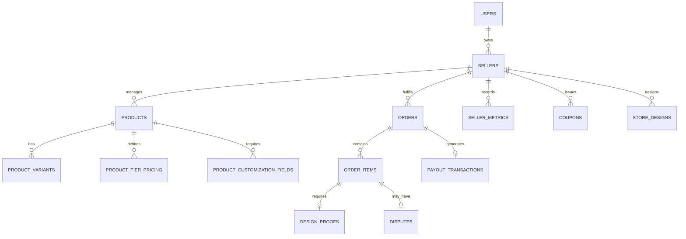
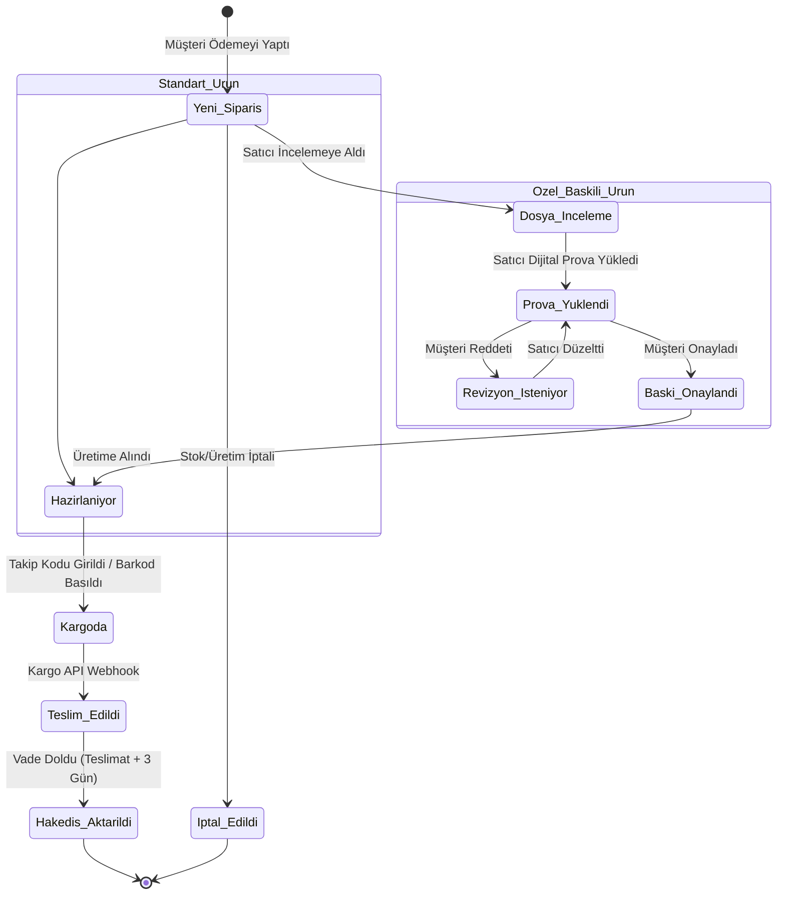

# BaskıYeri: Trendyol Benchmarklı Satıcı Paneli Mimari ve Uygulama Şartnamesi

Bu belge; `F:\dev\baskiyeripazar\baskier\trendyolpazaryeri` dizinindeki **120 adet ekran görüntüsü**, **3 adet operasyonel Excel raporu** ve **resmi lojistik sözleşmeleri** incelenerek, BaskıYeri'nin **baskı, ambalaj, promosyon ve özel üretim** odaklı pazar yeri gereksinimlerine göre hazırlanmış eksiksiz teknik mimari şartnamesidir.

Bir yazılımcı veya yapay zeka kodlama modeli bu belgeyi okuduğunda; veritabanı şemalarından API uçlarına, durum makinelerinden algoritmalara kadar tüm sistemi **sıfır belirsizlikle** uygulayabilmelidir.

---

## 🧭 1. Mimari Vizyon ve Sektörel Farklılaşma

Trendyol standart raf ürünleri (tişört, ayakkabı, kozmetik) satarken; BaskıYeri **kişiselleştirilmiş fiziksel üretim** orkestrasyonu yapar. Bu durum 4 temel mimari fark doğurur:

```
┌───────────────────────────────────┬────────────────────────────────────────────────────────┐
│ Standart E-Ticaret (Trendyol)     │ Özel Üretim & Baskı Pazaryeri (BaskıYeri)             │
├───────────────────────────────────┼────────────────────────────────────────────────────────┤
│ Sipariş anında kargoya hazırlanır │ Sipariş önce Tasarım/Dosya onayı gerektirir            │
│ Cayma hakkı 14 gün koşulsuzdur    │ Kişiye özel baskıda keyfi cayma hakkı YOKTUR (TKHK 15) │
│ Ürün başına desi ve termin sabit  │ Tiraja (adede) göre ağırlık, desi ve termin değişkendir│
│ MOQ genellikle 1 adettir          │ Kalıp/baskı maliyeti nedeniyle baremli MOQ zorunludur  │
└───────────────────────────────────┴────────────────────────────────────────────────────────┘
```

---

## 🗄️ 2. Veritabanı Varlık-İlişki Mimarisi (Entity-Relationship)

Sistemin Faz 1'den Faz 4'e kadar kesintisiz büyümesini sağlayan, genişleyebilir PostgreSQL/MySQL şeması:



### 2.1. Tablo Şemaları ve Alan Detayları

#### `sellers` (Mağazalar / Üreticiler)
- `id` (UUID, PK)
- `user_id` (UUID, FK -> users.id)
- `store_name` (VARCHAR(100), Unique)
- `slug` (VARCHAR(100), Unique)
- `logo_url` (VARCHAR(255), Nullable)
- `banner_url` (VARCHAR(255), Nullable)
- `seller_score` (DECIMAL(3,2), Default: 10.00) — *Screenshot_88*
- `commission_rate` (DECIMAL(5,2), Default: 15.00)
- `daily_shipment_capacity` (INT, Default: 100) — *Screenshot_25: Günlük kargo çıkış limiti*
- `cutoff_time` (TIME, Default: '12:00:00') — *Screenshot_23: Bugün kargoda kesme saati*
- `is_approved` (BOOLEAN, Default: false)
- `badges` (JSONB, Default: '[]') — *['fast_shipper', 'top_rated']*
- `created_at`, `updated_at`

#### `products` (Ürün Ana Tablosu)
- `id` (UUID, PK)
- `seller_id` (UUID, FK -> sellers.id)
- `category_id` (UUID, FK -> categories.id)
- `title` (VARCHAR(255))
- `barcode` (VARCHAR(50), Unique, Nullable)
- `model_code` (VARCHAR(50))
- `stock_code` (VARCHAR(50))
- `description` (TEXT)
- `is_customizable` (BOOLEAN, Default: false) — *2-ürünbilgsi-2.png: Kişiselleştirilebilir ürün toggle'ı*
- `gift_packaging_option` (ENUM: 'none', 'available', 'available_with_note') — *2-ürünbilgsi-2.png*
- `lead_time_days` (INT, Default: 3) — *Termin süresi*
- `tax_rate` (DECIMAL(4,2), Default: 20.00)
- `status` (ENUM: 'draft', 'pending_approval', 'active', 'passive', 'archived')
- `created_at`, `updated_at`

#### `product_tier_pricings` (Tiraj / Adet Fiyat Baremleri & MOQ)
- `id` (UUID, PK)
- `product_id` (UUID, FK -> products.id)
- `min_quantity` (INT, Not Null) — *Örn: 100*
- `max_quantity` (INT, Nullable) — *Örn: 499 (Null ise sonsuz)*
- `unit_price` (DECIMAL(12,2), Not Null)
- `created_at`, `updated_at`

#### `product_customization_fields` (Özel Baskı Parametreleri)
- `id` (UUID, PK)
- `product_id` (UUID, FK -> products.id)
- `field_name` (VARCHAR(100)) — *Örn: "Baskı Dosyası", "Yazılacak İsim"*
- `field_type` (ENUM: 'file_upload', 'text', 'select', 'color')
- `is_required` (BOOLEAN, Default: true)
- `allowed_extensions` (VARCHAR(100), Default: 'pdf,ai,psd,eps,tiff,jpg')
- `min_dpi` (INT, Default: 150)
- `aspect_ratio` (VARCHAR(20), Nullable)

#### `order_items` & `design_proofs` (Baskı Onay ve Sipariş Akışı)
- `order_items.id` (UUID, PK)
- `order_id` (UUID, FK -> orders.id)
- `product_id` (UUID, FK -> products.id)
- `seller_id` (UUID, FK -> sellers.id)
- `quantity` (INT)
- `unit_price` (DECIMAL(12,2))
- `tax_amount` (DECIMAL(12,2))
- `commission_amount` (DECIMAL(12,2))
- `seller_payout_amount` (DECIMAL(12,2))
- `shipping_cost` (DECIMAL(12,2))
- `customer_uploaded_files` (JSONB) — *Müşterinin siparişte yüklediği ham dosyalar*
- `status` (VARCHAR(50), Default: 'pending_review')

- `design_proofs.id` (UUID, PK)
- `order_item_id` (UUID, FK -> order_items.id)
- `proof_file_url` (VARCHAR(255)) — *Satıcının hazırladığı PDF/görsel prova*
- `proof_notes` (TEXT, Nullable)
- `customer_status` (ENUM: 'pending', 'approved', 'revision_requested')
- `revision_notes` (TEXT, Nullable)
- `approved_at` (TIMESTAMP, Nullable)
- `created_at`, `updated_at`

#### `payout_transactions` (Finans ve Hakediş Motoru)
- `id` (UUID, PK)
- `order_item_id` (UUID, FK -> order_items.id)
- `seller_id` (UUID, FK -> sellers.id)
- `gross_amount` (DECIMAL(12,2))
- `commission_cut` (DECIMAL(12,2))
- `shipping_cut` (DECIMAL(12,2))
- `net_payout` (DECIMAL(12,2))
- `status` (ENUM: 'blocked_escrow', 'available', 'paid', 'cancelled')
- `due_date` (DATE) — *Vade tarihi: Teslimat + 3 iş günü*
- `paid_at` (TIMESTAMP, Nullable)

#### `holidays` (Resmi Tatil Takvimi) — *Screenshot_26*
- `id` (INT, PK)
- `date` (DATE, Unique)
- `description` (VARCHAR(100))
- `year` (INT)

---

## ⚙️ 3. İş Akışları ve Durum Makineleri (State Machines)

### 3.1. Sipariş Yaşam Döngüsü (Order Workflow)



#### Durum Geçiş Kuralları (Guard Conditions):
1. `is_customizable = true` olan ürünlerde, `proof_approved` durumu oluşmadan sipariş kesinlikle `in_production` (hazırlanıyor) veya `shipped` durumuna geçirilemez.
2. Müşteri, prova onaylanana kadar siparişi iptal edebilir. Prova onaylandıktan sonra müşteri arayüzündeki "Siparişi İptal Et" butonu pasife alınır (Hukuki dayanak: TKHK m. 15/b).

### 3.2. İade & Kusurlu Baskı İhtilaf Akışı (Dispute Workflow)

```mermaid
graph TD
    A[Müşteri Kusurlu Baskı Bildirimi Yapar] --> B[Kusurlu Ürün Fotoğrafı & Detay İstenir]
    B --> C{Satıcı Kabul Etti mi?}
    C -->|Evet| D[Yeniden Üretim veya Para İadesi]
    C -->|Hayır (İtiraz)| E[BaskıYeri Moderasyon Masasına Düşer]
    E --> F[Moderatör: Onaylanan Dijital Prova vs Müşteri Fotoğrafı]
    F -->|Hata Satıcıda| G[Satıcıya Ceza Puanı + Müşteriye İade]
    F -->|Hata Müşteride| H[Talep Reddedilir + Gerekçeli Rapor]
```

---

## 📦 4. Lojistik, Termin ve Kapasite Algoritmaları

### 4.1. Termin Süresi Hesaplama Formülü

Satıcı panelinden gelen `cutoff_time` (Örn: 12:00) ve resmi tatiller hesaba katılarak kargoya teslim tarihi belirlenir:

```
Fonksiyon: getShipmentDeadline(siparisZamani, terminGunu, magazaCutoff, tatilListesi)
1. Eger siparisZamani.saat >= magazaCutoff:
     hesaplamaBaslangici = Ertesi gun saat 09:00
   Degilse:
     hesaplamaBaslangici = siparisZamani
2. kalanIsGunu = terminGunu
3. geciciTarih = hesaplamaBaslangici
4. Dongu (kalanIsGunu > 0):
     geciciTarih = geciciTarih + 1 gun
     Eger geciciTarih PAZAR gunu degilse VE tatilListesi icinde yoksa:
       kalanIsGunu = kalanIsGunu - 1
5. Donus: geciciTarih saat 18:00
```

### 4.2. Günlük Kapasite Kotası Algoritması
* Her satıcının bir `daily_shipment_capacity` değeri vardır (Örn: 50 paket/gün).
* Bir tarihe ait aktif sipariş sayısı bu kapasiteye ulaştığında:
  - Sistem o satıcının tüm ürünlerinin termin süresini otomatik olarak `+1 iş günü` öteler.
  - Müşteri sepette gerçekçi bir kargo tarihi görür; satıcı gecikme cezası almaz.

---

## 🏆 5. Satıcı Puanı Hesaplama Motoru (Screenshot_88)

Satıcı puanı **10.00 puan** üzerinden her gece `02:00`'de çalışan bir Cron Job ile hesaplanır. Son 30 günlük veriler baz alınır:

$$\text{Satıcı Puanı} = (W_1 \times P_{\text{zamanında\_teslim}}) + (W_2 \times P_{\text{kusursuzluk}}) + (W_3 \times P_{\text{cevaplama}}) + (W_4 \times P_{\text{musteri\_yildizi}})$$

| Metrik ($P_x$) | Ağırlık ($W_x$) | Hedef Eşik Değeri | Formül / Kriter |
| :--- | :---: | :---: | :--- |
| **Kargoya Zamanında Teslim Oranı** | **%35** | $\ge \%98$ | $(\text{Zamanında Teslim Edilen} / \text{Toplam Sipariş}) \times 10$ |
| **Kusursuz Ürün / Tedarik Oranı** | **%35** | $\le \%0.5$ | $10 - ((\text{Kusur + İptal Adedi} / \text{Toplam Sipariş}) \times 50)$ |
| **Soru Cevaplama Süresi** | **%15** | $< 30 \text{ dk}$ | Ortalama 30 dk altı: 10 puan, her ekstra 1 saat için -1 puan |
| **Müşteri Yorum Ortalaması** | **%15** | $\ge 4.5 / 5$ | $(\text{Ortalama Yıldız} / 5) \times 10$ |

---

## 🛠️ 6. UYGULAMA FAZLARI (DETAYLI TEKNİK ŞARTNAME)

---

### 🚀 FAZ 1: CAN DAMARI (MVP / İLK 30 GÜN)
*Motto: Satıcı ürününü eksiksiz listelesin, siparişini dijital prova ile yönetsin, parasını şeffafça takip etsin.*

#### 1. Ürün Yönetimi Modülü
- **Frontend Ekranları**:
  - `ProductList.vue / .tsx`: Filtreler (Barkod, Stok Kodu, Model Kodu, Kategori, Durum).
  - Hızlı Düzenleme (Inline Edit): Satır üzerinde Fiyat, Stok ve Termin güncelleme.
  - `ProductCreateWizard.vue / .tsx`: 4 Adımlı ürün formu:
    1. Temel Bilgiler (Başlık, Kategori, Marka, Model Kodu, Açıklama).
    2. Kişiselleştirme Ayarı (**Baskılı mı? Hazır stok mu? Dosya yükleme zorunlu mu?**).
    3. Fiyat & Tiraj Baremleri (**MOQ ve Adet Kırılımlı Fiyat Tablosu**).
    4. Kargo & Teslimat (Desi, Termin süresi).
- **Backend API Uçları**:
  - `GET /api/v1/seller/products` (Filtreli, sayfalı ürün listesi).
  - `POST /api/v1/seller/products` (Yeni ürün oluşturma).
  - `PUT /api/v1/seller/products/{id}` (Ürün güncelleme).
  - `PATCH /api/v1/seller/products/{id}/quick-update` (Hızlı inline fiyat/stok güncelleme).

#### 2. Sipariş & Dijital Prova (Proofing) Modülü
- **Frontend Ekranları**:
  - `OrderList.vue`: Durum sekmeleri (`Yeni`, `Prova Bekleyen`, `Üretimde`, `Kargoda`, `Tamamlanan`, `İptal`).
  - `OrderDetailModal.vue`: Müşterinin yüklediği orijinal dosyaları önizleme / indirme.
  - `ProofUploadModal.vue`: Satıcının onay için PDF/JPEG provayı sisteme yüklemesi.
- **Backend API Uçları**:
  - `GET /api/v1/seller/orders` (Durum bazlı siparişler).
  - `GET /api/v1/seller/orders/{id}` (Sipariş detay + müşteri dosyaları).
  - `POST /api/v1/seller/orders/{id}/proof` (Dijital prova yükleme, bildirim tetikleme).
  - `POST /api/v1/seller/orders/{id}/ship` (Kargo takip no girme / etiket oluşturma).

#### 3. Finans ve Net Hakediş Paneli
- **Frontend Ekranları**:
  - `FinanceDashboard.vue`: Vadesi gelen hakediş, blokeli bakiye, sipariş bazlı net kazanç tablosu.
- **Backend API Uçları**:
  - `GET /api/v1/seller/finance/summary` (Cüzdan ve bakiye özeti).
  - `GET /api/v1/seller/finance/transactions` (Sipariş bazlı komisyon ve kargo kesinti dökümü).

---

### ⚡ FAZ 2: GÜVEN, HIZ VE KALİTE MOTORU (30 - 60 GÜN)
*Motto: Operasyonel hataları önle, satıcı kalitesini puanla, termin disiplini sağla.*

#### 1. Termin, Takvim & Kapasite Servisi
- `HolidayService`: 2026 ve sonraki yılların resmi tatillerini içeren dinamik takvim.
- `ShipmentCapacityChecker`: Satıcının günlük sipariş kotasını denetleyen middleware.
- Satıcı Operasyon Ayarları ekranı: Cut-off saati ve günlük kapasite belirleme.

#### 2. Otomatik Satıcı Puanı Motoru
- Gece çalışan Cron Job (`CalculateSellerScoresJob`).
- Satıcı panelinde detaylı puan karnesi: "Puanınızı Negatif Etkileyen Siparişler Listesi" (Trendyol Excel çıktısı benzeri CSV export).

#### 3. Kupon Oluşturma Sihirbazı (Screenshot_64 - 67)
- 4 Aşamalı Kupon Sihirbazı:
  - Kupon Tipi: Mağaza Kuponu, Üründen Kazan, Takipçi Kazan.
  - Barem Seçimi: "500 TL üzerine 50 TL indirim" veya "%10 İndirim".
  - Kupon geçerlilik tarihleri ve bütçe limiti.
- Canlı Mobil Önizleme (Sağ tarafta kuponun ürün sayfasında nasıl duracağını gösteren telefon maketi).

#### 4. Müşteri Soru-Cevap (Q&A) ve Moderasyon
- `QuestionService`: Ürün bazlı müşteri soruları.
- `ModerationMiddleware`: Telefon numarası, @, .com, iban içeren mesajları maskeleme.
- Satıcı için "Hazır Cevap Şablonları" (Canned Responses) ekleme imkanı.

---

### 📊 FAZ 3: BÜYÜME, ANALİTİK VE OTOMASYON (60 - 120 GÜN)
*Motto: Veriye dayalı büyü, satıcının iş yükünü yapay zeka ile hafiflet.*

#### 1. Canlı Performans Dashboard (Screenshot_70, 71)
- Redis tabanlı saatlik veri toplama (Hourly Rollups).
- Saatlik ciro karşılaştırma grafiği (Bugün vs Dün).
- KPI Kartları: Net Ciro, Net Sipariş, Görüntülenme, Satışa Dönüş Oranı.

#### 2. Toplu Excel İşlemleri (Screenshot_3, 4)
- `ProductExportJob` & `ProductImportJob`.
- Kategori bazlı Excel şablonu indirme, toplu fiyat/stok güncelleme, log ve hata raporlama tablosu.

#### 3. Yapay Zeka Destekli İçerik Üretimi (2-ürünbilgisi-1.png)
- LLM API entegrasyonu (OpenAI / Claude).
- Ürün ekleme ekranında "AI ile Açıklama Üret" butonu: Ürün özellikleri parametre olarak verilir, SEO uyumlu açıklama ve anahtar kelimeler oluşturulur.

#### 4. Satıcı Rozetleri ve Gamification
- "Hızlı Baskıcı", "Güvenilir Üretici" rozetlerinin koşulları sağlayan satıcılara otomatik verilmesi.

---

### 🏛️ FAZ 4: ENTERPRISE VE ÖLÇEKLENME (120+ GÜN & GELECEĞE HAZIRLIK)
*Motto: Modüler vitrin dizaynı, dahili reklam motoru ve sınır ötesi ihracat.*

Şu an kodlanmayacak ancak **veritabanı ve mimari altyapısı bu fazı kabul edecek şekilde tasarlanmıştır**:

#### 1. Sürükle-Bırak Mağaza Tasarımcısı (Storefront Builder)
- **Mimari Altyapı:**
  - `store_designs` tablosu: `seller_id`, `layout_json` (Bileşen ağacı - AST).
  - Desteklenen bloklar: `BannerBlock`, `ProductCarouselBlock`, `CategoryGridBlock`, `CouponStripBlock`, `VideoEmbedBlock`.
  - Frontend: JSON'u dinamik render eden `StorefrontRenderer.tsx` bileşeni.

#### 2. Dahili Tıklama Başı Maliyet (CPC) Reklam Motoru
- **Mimari Altyapı:**
  - `ad_wallets`: Satıcının reklam bütçesi bakiyesi.
  - `ad_campaigns`: Reklam verilen ürünler, günlük bütçe, tıklama başı teklif (Max CPC).
  - Arama motorunda (Elasticsearch / Meilisearch) sponsorlu ürünlere yapay ağırlık (boost score) verilmesi.

#### 3. Sınır Ötesi Mikro İhracat & MSDS Belge Denetimi
- **Mimari Altyapı:**
  - `compliance_documents`: MSDS (Malzeme Güvenlik Formu), AB GPSR Yetkili Temsilci belgeleri.
  - Çoklu para birimi ve ülke bazlı gümrük kargo kapasite tanımları.

---

## 💻 7. Geliştirici & AI Uygulama Talimatları (Implementation Guidelines)

1. **Service-Repository Pattern:** Tüm iş mantığı Controller'larda değil; `OrderWorkflowService`, `PricingTierService`, `ProofApprovalService`, `SellerMetricService` servislerinde toplanmalıdır.
2. **Event-Driven Architecture:**
   - Sipariş verildiğinde $\rightarrow$ `OrderCreatedEvent`
   - Prova yüklendiğinde $\rightarrow$ `ProofUploadedEvent`
   - Prova onaylandığında $\rightarrow$ `ProofApprovedEvent` $\rightarrow$ Satıcıya SMS/Mail/Push bildirim.
3. **Katı Para İşlemleri:** Tüm fiyat ve hakediş hesaplarında `float` yerine `BCMath` veya `integer (kuruş)` hassasiyeti kullanılmalıdır.
4. **Hukuki Güvence:** Mesafeli Satış Sözleşmesi ve Ön Bilgilendirme Formları her sipariş için dinamik üretilip PDF olarak S3/MinIO üzerinde değiştirilemez şekilde saklanmalıdır.

---
*Bu şartname, BaskıYeri'nin Türkiye ve küresel pazarda sürdürülebilir, yüksek karlı ve hatasız bir matbaa/baskı pazaryeri olarak ölçeklenmesinin ana anayasasıdır.*
